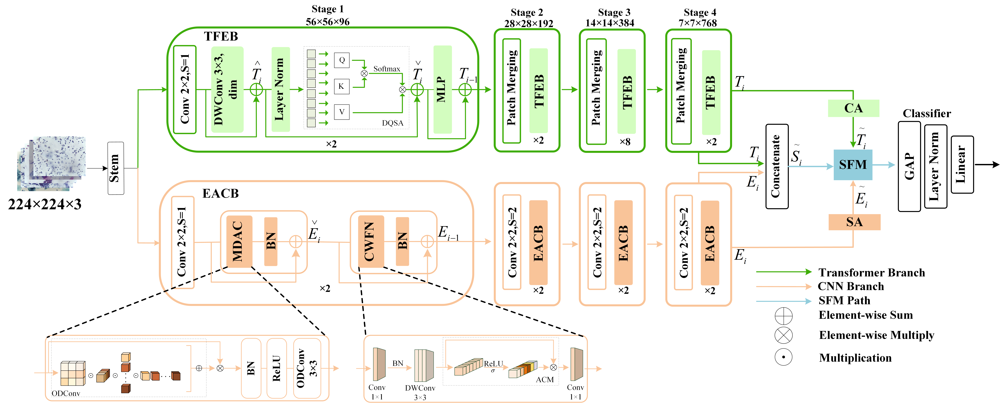

# CNN and Transformer fusion for cervical cell classification network
This is the code implementation of `DualBranch-FusionNet: A Hybrid CNN-Transformer Architecture for Cervical Cell Image Classification`.

The main branch work with **Python 3.10**, **Pytorch 2.1.1+cu118**
# Method
EACB is implemented in `EACB.py` and TFEB is implemented in `TFEB.py`.
# Run
Run the `train.py` file to start training the network, and `config.py` is the configuration of relevant parameters.

If you need to load pre-trained weights, enter `python train.py --pre weights/best.pth` in the console.
# Other
Where `CrossValidationDataLoader.py` file performs the cross validation division of the dataset and `augm.py` is the data preprocessing operation.

`train_binary.py` for binary data training, `binary_dataloader.py` for loading binary dataset and `config_binary.py` for configuring binary dataset related parameters.

